# TestNG Eclipse plug-in

The TestNG Eclipse plug-in allows you to run your TestNG tests from Eclipse and easily monitor their execution and their output. It has its own project repository called testng-eclipse.


### Installation

Follow the instructions to install the plug-in.

> NOTE: since TestNG Eclipse Plugin 6.9.10, there is a new optional plug-in for M2E (Maven Eclipse Plugin) integration. It's recommended to install it if your Java project(s) are managed by Maven.


Once done, restart Eclipse and select the menu Window / Show View / Other...  and you should see the TestNG view listed in the Java category.

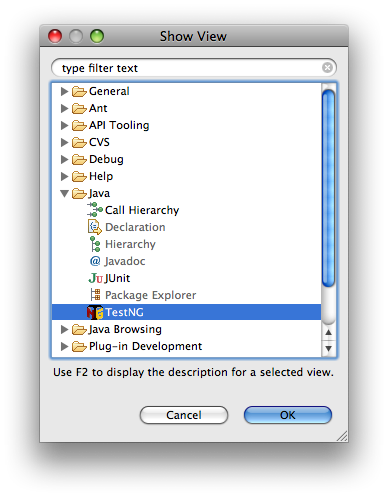

> NOTE: since TestNG Eclipse Plugin 6.9.8, the minimum required TestNG version is 6.5.1

###  Creating a TestNG class

To create a new TestNG class, select the menu File / New / TestNG:

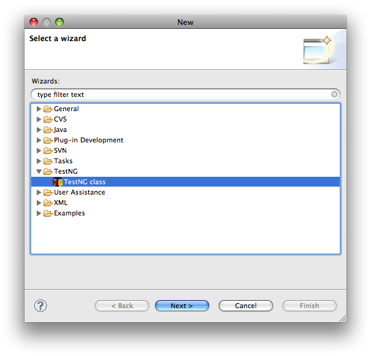

If you currently have a Java file open in the editor or if you have a Java file selected in the Navigator, the first page of the wizard will show you a list of all the public methods of that class and it will give you the option to select the ones you want to test. 

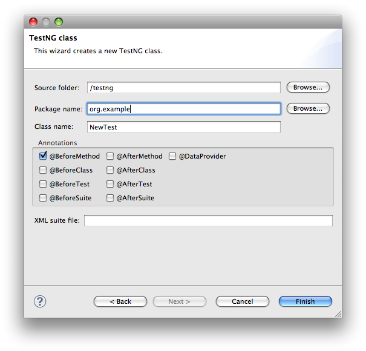

Each method you select on this page will be included in the new TestNG class with a default implementation that throws an exception, so you remember to implement it.


The next page lets you specify where that file will be created, whether it should contain default implementation for some configuration methods, if you'd like a data provider and finally, if a testng.xml file should be generated.


The plug-in will make a guess about the best location where this file should be created (for example, if you are using Maven, the default location will be under src/test/java).

### Launch configuration

Once you have created classes that contain TestNG annotations and/or one or more testng.xml files, you can create a TestNG Launch Configuration.  Select the Run / Run... (or Run / Debug...) menu and create a new TestNG configuration:

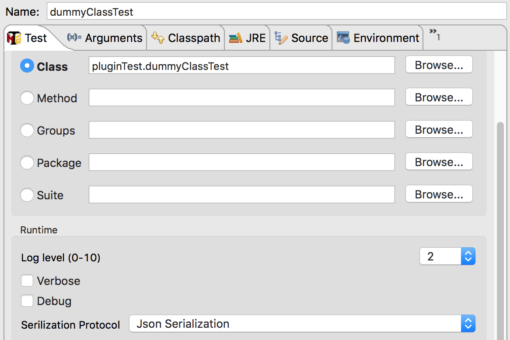

You should change the name of this configuration and pick a project, which can be selected by clicking on the Browse... button at the top of the window.

Runtime options:

* Log Level: specify the value (0-10) for different verbose log levels
* Verbose: enable the runtime TestNG verbose log
* Debug: enable more runtime TestNG debug info
* Serialization Protocol: the serialization protocol used for communicating between TestNG Eclipse Plugin and TestNG runtime.
* Json Serialization: This protocol was introduced in the TestNG Eclipse plug-in 6.9.11 to better communicate with a different JRE running TestNG.
* Object Serialization: This protocol packs the message data with Java serialization.
* String Serialization: Deprecated.

Then you choose to launch your TestNG tests in the following ways:

#### From a class file
Make sure the box near Class is checked and then pick a class from your project.  You can click on the Browse... button and pick it directly from a list.  This list only contains classes that contain TestNG annotations:

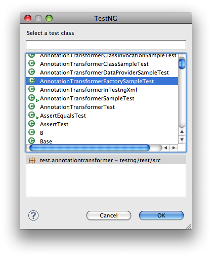


#### From groups

If you only want to launch one or several groups, you can type them in the text field or pick them from a list by clicking on the Browse... button 

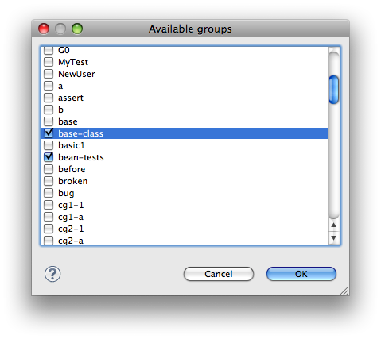

#### From a definition file

Finally, you can select a suite definition from your project. It doesn't have to be named testng.xml, the plug-in will automatically identify all the applicable TestNG XML files in your project:

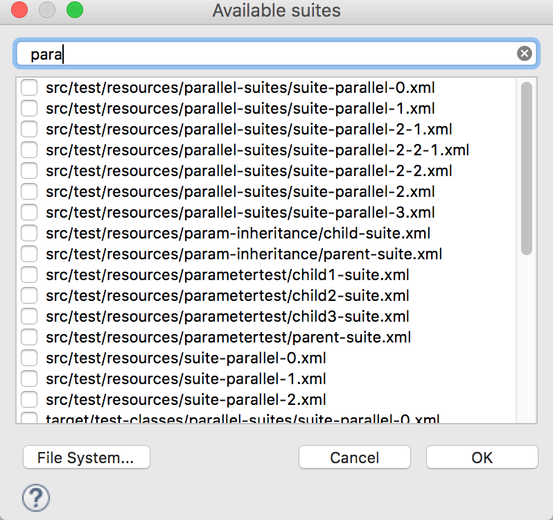

You can type the regex on the filter text field to narrow down to suite definition files matching your search from a long list of files.

#### From a method

This launch isn't accomplished from the Launch dialog but directly from your Outline view:

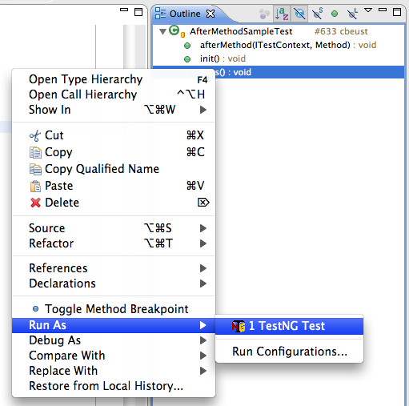

You can right-click on any test methods and select Run as... / TestNG test and only the selected method will be run (not shown on the above screenshot because I couldn't find a way to capture a contextual menu).
Method launching is also available from the Package Explorer view and from the Java Browser perspective.

Once you have selected one of these launches, you can also choose the logging of level. Then you can launch the tests by pressing the Debug (or Run) button, which will switch you to the Debug perspective and will open the main TestNG view.

#### Specifying listeners and other settings

As you saw above, the plug-in will let you start tests in many different ways: from an XML file, from a method, a class, etc... When you are running an XML file, you can specify all the settings you want for this run in the XML file, but what 

if you want to run a package in parallel mode with specific listeners? How can you configure the settings for all the launches that are not done from an XML file?

In order to give you access to the most flexibility, TestNG lets you specify an XML suite file for all these launches, which you can find in the Preferences menu:

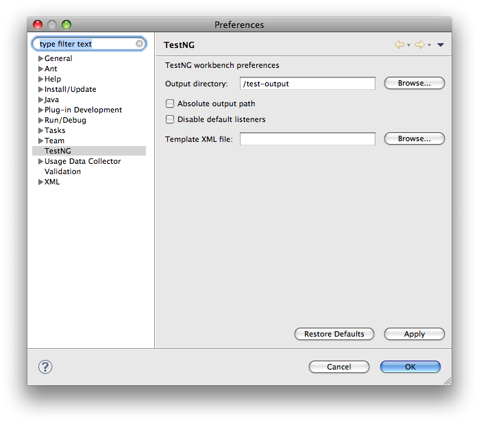


If you specify a valid suite file as "XML template file", TestNG will reuse all the settings found in this XML file, such as parallel, name, listeners, thread pool size, etc... Only the &lt;test&gt; tags in this file will be ignored since the plug-in will replace these by a generated &lt;test&gt; tag that represents the launch you chose.


### Viewing the test results

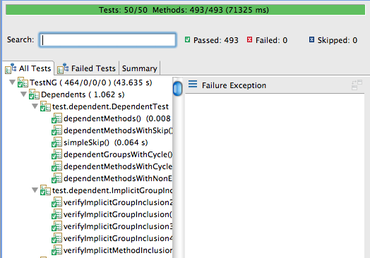

The above view shows a successful run of the tests:  the bar is green and no failed tests are reported.  The All tests tab shows you a list of all the classes and methods that were run.

If your test run contains failures, the view will look like this:


You can use the Failed tests tab to display only these tests that failed, and when you select such a test, the stack trace will be shown on the right-hand pane.  You can double click on the offending line to be taken directly to the failure in your code.

### Search

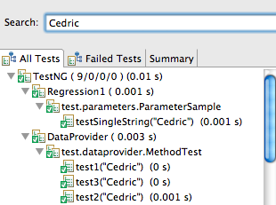

When you have hundreds of tests running, finding a specific one is not always easy, so you can type a few letters of the test method or its parameters in the Search box and the content of the tree will automatically narrow down to methods matching your search. Note in the screen shot above that the search also works on parameters provided by @DataProvider.

### Summary

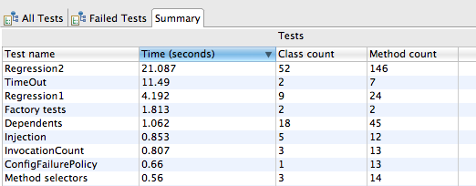 

The Summary tab gives you statistics on your test run, such as the timings, the test names, the number of methods and classes, etc… Since the results are shown in a table, you can also sort on any criterion you like for easier parsing. This is especially handy when you are trying to determine what tests take the longest time.

The search box works in this view as well, and note that in the screen shot below, the Time column is sorted in decreasing order:

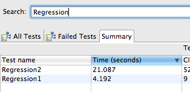 

### Converting JUnit tests

You can easily convert JUnit 3 and JUnit 4 tests to TestNG.
Your first option is to use the Quick Fix function:

 


Convert from JUnit 3

 

Convert from JUnit 4

You can also convert packages or entire source folders with the conversion refactoring:

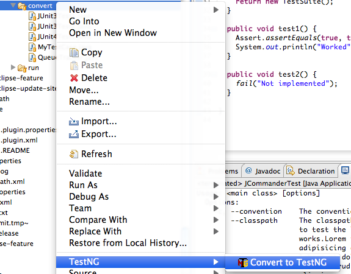 

The refactoring wizard contains several pages:

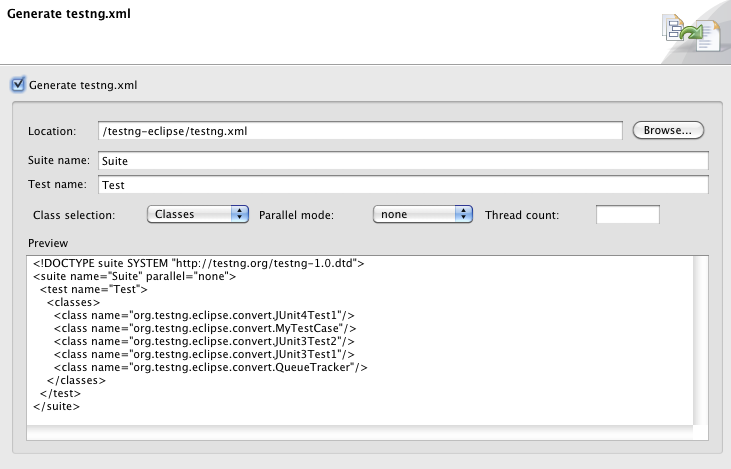 

This page lets you generate a testng.xml automatically. You can configure whether to include your test classes individually or by package, the suite and test name and also whether these tests should run in parallel.

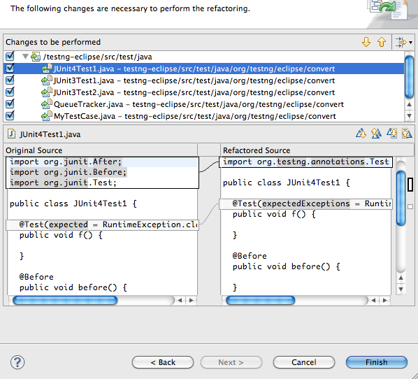  

This page gives you an overview of the changes that are about to be performed. You can also decide to exclude certain files from the refactoring.

When you are done, press the "Finish" button. Like all Eclipse refactorings, you can undo all these changes in one click:

 

### Quick fixes

The TestNG Eclipse plug-in offers several quick fixes while you are editing a TestNG class (accessible with Ctrl-1 on Windows/Linux and ⌘-1 on Mac OS):

#### Convert to JUnit

This was covered in the [previous section](#converting-junit-tests).

#### Pushing and pulling @Test annotations

If you have several test methods annotated with @Test and you'd like to replace them all with a single @Test annotation at the class level, choose the "Pull annotation" quick fix. Reciprocally, you can move a class level @Test annotation onto all your public methods or apply a quick fix on an assert method to automatically import it.


### Preferences and Properties
#### Workbench Preferences

TestNG workbench preferences:

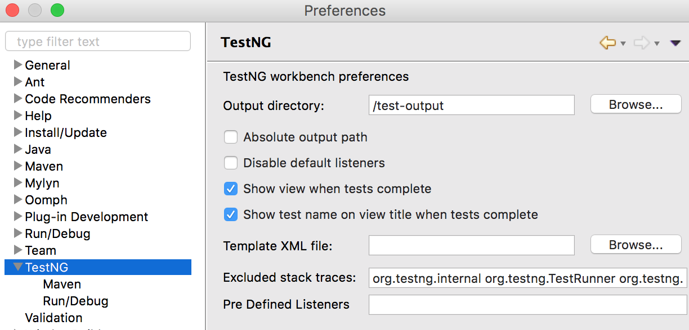 

The preferences here are shared among projects and launch configurations.

* Output directory: the path where to store the output including temp files, report files, etc... By default, the path is relative to each project except if you check the option Absolute output path below.
* Absolute output path: whether the path above is absolute or relative to the current project.
* Disable default listeners: disable the default listeners when launching TestNG.
* Show view when test complete: activate the TestNG result view when the test completes.
* Template XML file: the absolute path of the template XML file used to genernate the custom test suite XML file before launching.
* Excluded stack traces:
* Predefined Listeners:

####  Project Properties

Project level properties:

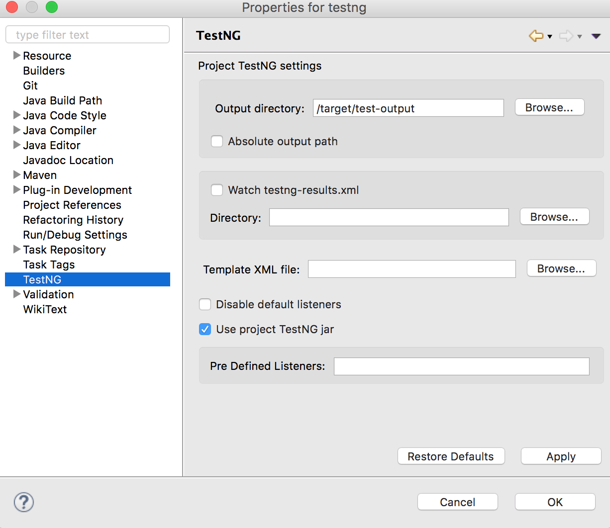 

Here are properties on each project level, it will override the same properties if defined in [TestNG workbench preferences](#workbench-preferences)

* Output directory: for example, in the figure above, I prefer to put the output to maven 'target' directory rather than the default one under project root
* Watch testng-result.xml:
* Template XML file: see in TestNG workbench preferences
* Predefined Listeners: see in TestNG workbench preferences

####  M2E Integration
The (optional) TestNG M2E Integration plug-in was introduced in 6.9.10. It allows you to run your tests with System Properties or JVM settings, which are defined by maven-surefire-plugin or maven-failsafe-plugin of pom.xml, to be appended to the runtime TestNG process. Once this plugin installed, you can see a dedicated preference page (workspace level settings):

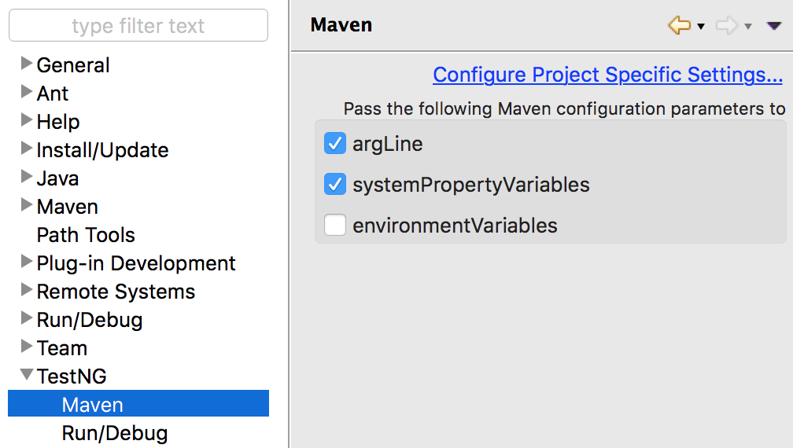 

or on the project properties page. You can override workspace settings with project specific ones:

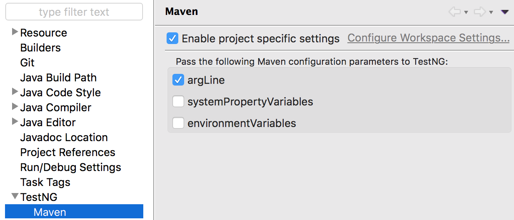 

Let's say there is maven-surefire-plugin confguration in your pom.xml:

```xml
<artifactId>maven-surefire-plugin</artifactId>
<configuration>
    <suiteXmlFiles>
    <suiteXmlFile>test-suite/testng.xml</suiteXmlFile>
    </suiteXmlFiles>
    <argLine>-javaagent:${settings.localRepository}/org/aspectj/aspectjweaver/${aspectj.version}/aspectjweaver-${aspectj.version}.jar
                -Xmx1024m -XX:MaxPermSize=512m -Xms256m -Xmx1024m -XX:PermSize=128m
                -Dversion=${project.version}
    </argLine>
    <systemPropertyVariables>
    <foo>${foo.value}</foo>
    </systemPropertyVariables>
    <environmentVariables>
    <bar>${bar.value}</bar>
    </environmentVariables>
</configuration>
``` 

You can pass the following Maven configuration parameters to the TestNG process:

* argLine: the JVM arguments
* systemPropertyVariables: the system properties
* environmentVariables: the environment variables

> NOTE: as the snippet of the configuration above shows, properties placeholders (e.g. ${aspectj.version}) in argLine or systemPropertyVariables will be substituted and correctly passed to the TestNG process as long as the properties are visible on the Maven project (e.g. defined in the current pom.xml, or inherited from the parent pom.xml, etc.).


> NOTE: if your maven-surefire-plugin is defined in a Maven profile, you will need to select the Maven profile which contains the maven-surefire-plugin configuration: "Right click on the project -> Maven -> Select Maven Profiles...", then check the profile you need.