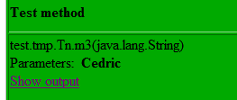
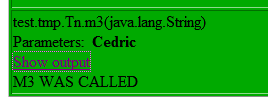

#Test Results 

### Success, failure and assert
A test is considered successful if it completed without throwing any exception or if  it threw an exception that was expected (see the documentation for the expectedExceptions attribute found on the @Test annotation).

Your test methods will typically be made of calls that can throw an exception, or of various assertions (using the Java "assert" keyword).  An "assert" failing will trigger an AssertionErrorException, which in turn will mark the method as failed (remember to use -ea on the JVM if you are not seeing the assertion errors).

Here is an example test method:

```java 
@Test
public void verifyLastName() {
  assert "Beust".equals(m_lastName) : "Expected name Beust, for" + m_lastName;
}
``` 

TestNG also include JUnit's Assert class, which lets you perform assertions on complex objects:

```java 
import static org.testng.AssertJUnit.*;
//...
@Test
public void verify() {
  assertEquals("Beust", m_lastName);
}

``` 
> Note that the above code use a static import in order to be able to use the assertEquals method without having to prefix it by its class.

### Logging and results

The results of the test run are created in a file called index.html in the directory specified when launching SuiteRunner.  This file points to various other HTML and text files that contain the result of the entire test run.
It's very easy to generate your own reports with TestNG with Listeners and Reporters:

* Listeners implement the interface [org.testng.ITestListener](https://jitpack.io/com/github/cbeust/testng/master/javadoc/org/testng/ITestListener.html) and are notified in real time of when a test starts, passes, fails, etc...
* Reporters implement the interface [org.testng.IReporter](https://jitpack.io/com/github/cbeust/testng/master/javadoc/org/testng/IReporter.html) and are notified when all the suites have been run by TestNG. The IReporter instance receives a list of objects that describe the entire test run.

For example, if you want to generate a PDF report of your test run, you don't need to be notified in real time of the test run so you should probably use an IReporter. If you'd like to write a real-time reporting of your tests, such as a GUI with a progress bar or a text reporter displaying dots (".") as each test is invoked (as is explained below), ITestListener is your best choice.

#### Logging Listeners

Here is a listener that displays a "." for each passed test, a "F" for each failure and a "S" for each skip:

```java 
public class DotTestListener extends TestListenerAdapter {
  private int m_count = 0;
 
  @Override
  public void onTestFailure(ITestResult tr) {
    log("F");
  }
 
  @Override
  public void onTestSkipped(ITestResult tr) {
    log("S");
  }
 
  @Override
  public void onTestSuccess(ITestResult tr) {
    log(".");
  }
 
  private void log(String string) {
    System.out.print(string);
    if (++m_count % 40 == 0) {
      System.out.println("");
    }
  }
}
``` 
In this example, I chose to extend [TestListenerAdapter](https://jitpack.io/com/github/cbeust/testng/master/javadoc/org/testng/TestListenerAdapter.html), which implements [ITestListener](https://jitpack.io/com/github/cbeust/testng/master/javadoc/org/testng/ITestListener.html) with empty methods, so I don't have to override other methods from the interface that I have no interest in. You can implement the interface directly if you prefer.

Here is how I invoke TestNG to use this new listener:

``` 
java -classpath testng.jar;%CLASSPATH% org.testng.TestNG -listener org.testng.reporters.DotTestListener test\testng.xml
and the output:
........................................
........................................
........................................
........................................
........................................
.........................
===============================================
TestNG JDK 1.5
Total tests run: 226, Failures: 0, Skips: 0
===============================================

``` 

>Note that when you use -listener, TestNG will automatically determine the type of listener you want to use.

#### Logging Reporters

The [org.testng.IReporter](https://jitpack.io/com/github/cbeust/testng/master/javadoc/org/testng/IReporter.html) interface only has one method:
```java 
public void generateReport(List<ISuite> suites, String outputDirectory)
``` 

This method will be invoked by TestNG when all the suites have been run and you can inspect its parameters to access all the information on the run that was just completed.

#### JUnitReports

TestNG contains a listener that takes the TestNG results and outputs an XML file that can then be fed to JUnitReport. Here is an example, and the ant task to create this report:

```xml
<target name="reports">
  <junitreport todir="test-report">
    <fileset dir="test-output">
      <include name="*/*.xml"/>
    </fileset>
  
    <report format="noframes"  todir="test-report"/>
  </junitreport>
</target>
```

> Note:  a current incompatibility between the JDK 1.5 and JUnitReports prevents the frame version from working, so you need to specify "noframes" to get this to work for now.

####  Reporter API
If you need to log messages that should appear in the generated HTML reports, you can use the class [org.testng.Reporter](https://jitpack.io/com/github/cbeust/testng/master/javadoc/org/testng/Reporter.html):

```java 
Reporter.log("M3 WAS CALLED");
``` 



#### XML Reports

TestNG offers an XML reporter capturing TestNG specific information that is not available in JUnit reports. This is particularly useful when the user's test environment needs to consume XML results with TestNG-specific data that the JUnit format can't provide. This reporter can be injected into TestNG via the command line with -reporter.

Here's a sample usage: 
```java 
-reporter org.testng.reporters.XMLReporter:generateTestResultAttributes=true,generateGroupsAttribute=true.

```

The full set of options that can be passed is detailed in the below table. Make sure to use :

* : - to separate the reporter name from its properties
* = - to separate key/value pairs for properties
* , - to separate multiple key/value pairs

Below is a sample of the output of such a reporter:

```xml
<testng-results>
  <suite name="Suite1">
    <groups>
      <group name="group1">
        <method signature="com.test.TestOne.test2()" name="test2" class="com.test.TestOne"/>
        <method signature="com.test.TestOne.test1()" name="test1" class="com.test.TestOne"/>
      </group>
      <group name="group2">
        <method signature="com.test.TestOne.test2()" name="test2" class="com.test.TestOne"/>
      </group>
    </groups>
    <test name="test1">
      <class name="com.test.TestOne">
        <test-method status="FAIL" signature="test1()" name="test1" duration-ms="0"
              started-at="2007-05-28T12:14:37Z" description="someDescription2"
              finished-at="2007-05-28T12:14:37Z">
          <exception class="java.lang.AssertionError">
            <short-stacktrace>
              <![CDATA[
                java.lang.AssertionError
                ... Removed 22 stack frames
              ]]>
            </short-stacktrace>
          </exception>
        </test-method>
        <test-method status="PASS" signature="test2()" name="test2" duration-ms="0"
              started-at="2007-05-28T12:14:37Z" description="someDescription1"
              finished-at="2007-05-28T12:14:37Z">
        </test-method>
        <test-method status="PASS" signature="setUp()" name="setUp" is-config="true" duration-ms="15"
              started-at="2007-05-28T12:14:37Z" finished-at="2007-05-28T12:14:37Z">
        </test-method>
      </class>
    </test>
  </suite>
</testng-results>
``` 

This reporter is injected along with the other default listeners so you can get this type of output by default. The listener provides some properties that can tweak the reporter to fit your needs. The following table contains a list of these properties with a short explanation:

Property| Comment |	Default value
----|----|----
outputDirectory	| A String indicating the directory where should the XML files be output.	| The TestNG output directory
timestampFormat	| Specifies the format of date fields that are generated by this reporter	| yyyy-MM-dd'T'HH:mm:ss'Z'
fileFragmentationLevel | An integer having the values 1, 2 or 3, indicating the way that the XML files are generated: 1 - will generate all the results in one file.  2 - each suite is generated in a separate XML file that is linked to the main file.3 - same as 2 plus separate files for test-cases that are referenced from the suite files. |1
splitClassAndPackageNames |	This boolean specifies the way that class names are generated for the &lt;class&gt; element. For example, you will get &lt;class class="com.test.MyTest"&gt; for false and &lt;class class="MyTest" package="com.test">&gt;for true.| false
generateGroupsAttribute	| A boolean indicating if a groups attribute should be generated for the &lt;test-method&gt; element. This feature aims at providing a straight-forward method of retrieving the groups that include a test method without having to surf through the &lt;group&gt; elements. |	false
generateTestResultAttributes |	A boolean indicating if an &lt;attributes&gt; tag should be generated for each &lt;test-method&gt; element, containing the test result attributes (See ITestResult.setAttribute() about setting test result attributes). Each attribute toString() representation will be written in a &lt;attribute name="[attribute name]"&gt; tag. |	false
stackTraceOutputMethod	| Specifies the type of stack trace that is to be generated for exceptions and has the following values: 0 - no stacktrace (just Exception class and message). 1 - a short version of the stack trace keeping just a few lines from the top.  2 - the complete stacktrace with all the inner exceptions  3 - both short and long stacktrace| 2
generateDependsOnMethods |	Use this attribute to enable/disable the generation of a depends-on-methods attribute for the &lt;test-method&gt; element.	|true
generateDependsOnGroups	| Enable/disable the generation of a depends-on-groups attribute for the &lt;test-method&gt; element.	|true

In order to configure this reporter you can use the -reporter option in the command line or the Ant task with the nested &lt;reporter&gt; element. For each of these you must specify the class org.testng.reporters.XMLReporter. Please note that you cannot configure the built-in reporter because this one will only use default settings. If you need just the XML report with custom settings you will have to add it manually with one of the two methods and disable the default listeners.

#### TestNG Exit Codes

When TestNG completes execution, it exits with a return code.

This return code can be inspected to get an idea on the nature of failures (if there were any).

The following table summarises the different exit codes that TestNG currently uses.

FailedWithinSuccess	| Skipped |	Failed |	Status Code | 	Remarks
----|----|---|---|----
No |	No|	No|	0	|Passed tests
No	|No	|Yes|	1	|Failed tests
No|	Yes	|No|	2	|Skipped tests
No|	Yes|	Yes|	3|	Skipped/Failed tests
Yes	|No|	No|	4	|FailedWithinSuccess tests
Yes	|No	|Yes|	5	|FailedWithinSuccess/Failed tests
Yes |	Yes	| No|	6	|FailedWithinSuccess/Skipped tests
Yes	|Yes	|Yes|	7	| FailedWithinSuccess/Skipped/Failed tests